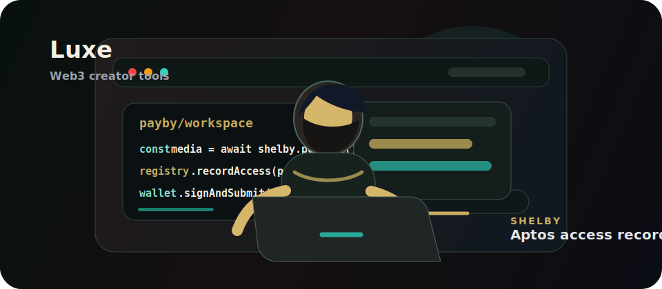

  

<h1 align="center">Luxe</h1>

  Web3 builder focused on creator tools, wallet-native media, and on-chain access systems.

  
  
  

---

## About

I build product-focused Web3 applications that connect real user workflows with on-chain state. My current work is centered on creator media infrastructure: publishing content to decentralized storage, recording access policy on-chain, and making buyer experiences simple enough for community use.

Current focus:

- Creator media vaults and wallet-aware access flows.
- Shelby storage integration for media publishing and retrieval.
- Aptos / Shelbynet smart contract registries.
- Clean product UI for Web3 users, not just technical demos.
- Community-ready dApps with clear onboarding, public pages, activity logs, and buyer receipts.

## Featured Project

### Payby

Payby is a creator media vault for publishing premium media to Shelby and recording listing, access, purchase, and creator profile state through Aptos-compatible wallets.

What it covers:

- Creator publish flow with Shelby media upload.
- On-chain listing and access policy records.
- Public creator pages and shareable media pages.
- Buyer library and wallet-scoped purchase receipts.
- Creator analytics, activity history, and network route visibility.

Links:

- Live app: [payby-pi.vercel.app](https://payby-pi.vercel.app)
- Repository: [github.com/biawakLahat/PayBy](https://github.com/biawakLahat/PayBy)

## Stack

  
  
  
  
  
  

## Engineering Direction

I care about dApps that feel serious in production:

- On-chain ownership and access where it matters.
- Wallet-scoped data instead of shared local mock state.
- Clear transaction states, failure messages, and recovery paths.
- Polished interfaces that help users understand what is happening.
- Real integrations before claims.

## GitHub Activity

  
  

---

  Building Web3 creator products with Shelby, Aptos, and production-grade frontend systems.

